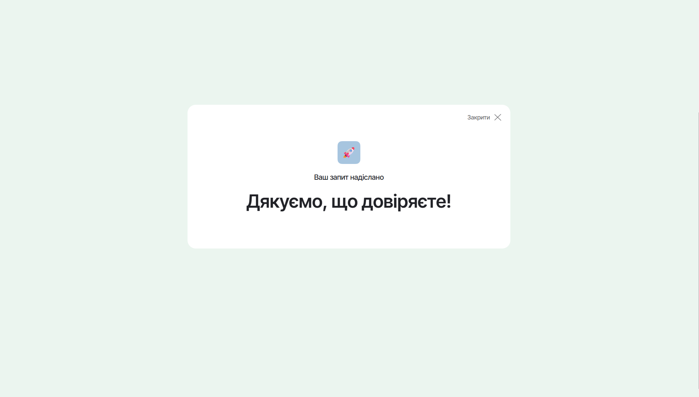

# Contact Form

WordPress theme that includes a section with a contact form. After submitting the form, a modal window appears.

<figure>
  
  <figcaption style="text-align: center">Contact form. The field whose data has not been validated is highlighted with a red color.</figcaption>
</figure>

&nbsp;

<figure>
  
  <figcaption style="text-align: center">Modal window appears after successful submitting form.</figcaption>
</figure>

## EN

### Task: Develop a feedback form (CTA Block)

#### The form layout must meet the following requirements:

1. Name (required, only letters and one space between words, prohibit entering a space as the first character).
2. Email (optional, accepts only email format).
3. Phone number (required, the ability to enter international numbers, prohibit entering letters).
4. Short description (textarea) (optional).
5. When developing the form, you can use a plugin or write your own custom form, the main thing is to comply with the requirements for functionality.

#### Front functionality:

1. If the form is not valid, the frame should turn red with an error message under the field.
2. When sending the form, there should be a spinner on the send button, and the button should also be disabled.
3. After successful submission, show a modal window (application accepted) and clear the form of entered data.

#### Backend functionality:

1. Submit the form via Ajax.
2. Form processing: If the fields are invalid, return an error to the form and indicate the fields with which there is a problem (the frame should turn red with an error message under the field).
3. Send the lead to the mail (with the ability to specify an email address via the admin. Assume that there can be multiple email addresses).
4. The lead should also come to the admin as a separate post type (custom post type).
5. Additionally (Will be a plus): Send the lead to a telegram bot, google sheets table.

- 🚨 All keys or links for connections must be added via the admin.

##### Note:

Hidden data that must be transmitted with the lead:

1. Date and time of sending
2. utm tags

### My notes:

The task has been completed in full. An adaptive layout has been developed for screens of different sizes. The layout also meets the requirements of cross-browser compatibility, thanks to the implementation of autoprefixer. No plugins were used when developing the form. On the backend, the data entered through the fields is processed - spaces at the beginning and end are removed, and between words - are collapsed to one. All possible errors are also processed on the backend and returned to the frontend with the corresponding codes - 400 or 500. Information about errors with code 400 appears under the corresponding form field, and information about errors with code 500 is displayed in the console.

**Important**: additional task (send lead to telegram bot, google sheets table) was completed, but not tested. Therefore, the relevant parts of the code are commented out for now. These parts are located in the theme file inc/\_form-handling.php and can be uncommented and tested if necessary. These are lines 4-6, 62, 104-128, 132-163.

### Installation and usage:

- Download the theme in zip format.
- In the administrative part of website, go to "Appearance" -> "Themes" -> "Add new theme" -> "Upload theme". Choose the archive and upload it. Activate the theme.
- Create a page, choosing the "Home Page" template. After creating a page using the template "Home Page" make it the homepage. For this go to "Settings" -> "Reading" -> "Your homepage displays", choose "A static page". In "Homepage" choose a page that was created using the "Home Page" template.

### Commands:

- npm install - installs npm dependencies
- composer install - installs Composer dependencies
- npm run build - launches the Gulp task manager

## UA

### Завдання: Розробити форму зворотнього зв'язку (Блок СТА)

#### Верстка форми повинна відповідати наступним вимогам:

1. Ім'я (обов'язкове, лише букви та один пробіл між словами, заборонити введення першим символом пробіл).
2. Електронна пошта (необов'язкове, приймає лише формат електронної пошти).
3. Номер телефону (обов'язкове, можливість введення міжнародних номерів, заборонити введення букв).
4. Короткий опис (textarea) (необов'язкове).
5. При розробці форми можете використовувати плагін або написати свою кастомну форму, головне щоб дотримувалися вимоги щодо функціоналу.

#### Функціонал front:

1. Якщо форма не валідна, рамка повинна ставати червоною з підписом про помилку під полем.
2. При надсиланні форми має бути спінер на кнопці надіслати, а також кнопка повинна бути вимкнена (disabled).
3. Після успішного надсилання, показати модальне вікно (заявка прийнята) і очистити форму від введених даних.

#### Функціонал Backend:

1. Надсилання форми через Ajax.
2. Обробка форми: Якщо поля прийшли не валідні, то повернути помилку в форму і вказати поля з якими проблема (рамка повинна ставати червоною з підписом про помилку під полем).
3. Лід надіслати на пошту (з можливістю вказати адресу електронної пошти через адмінку. Передбачити, що може бути декілька адрес електронної пошти).
4. Також лід повинен приходити в адмінку, як окремий тип запису (custom post type).
5. Додатково (Буде плюсом): Надіслати лід у телеграм бот, google sheets table.

- 🚨 Усі ключі або посилання для підключень повинні додаватися через адмінку.

##### Примітка:

Приховані дані, які повинні передаватися з лідом:

1.  Дата та час відправки
2.  utm мітки

### Мої примітки:

Завдання виконано у повному об'ємі. Розроблена адаптивна верстка під єкрани різних розмірів. Також верстка відповідає вимогам кросбраузерності, завдяки впровадженню autoprefixer. При розробці форми плагіни не були використані. На бекенді дані, введені через поля обробляються - пробіли на початку та кінці видаляються, а між словами - колапсуть до одного. Всі можливі помилки теж обробляються на бекенді та повертаються на фронтенд з відповідними кодами - 400 або 500. Інформація про помилки з кодом 400 з'являється під відповідним полем форми, а інформація про помилки з кодом 500 виводиться у консоль.

**Важливо**: додаткове завдання (надіслати лід у телеграм бот, google sheets table) було виконано, але не протестовано. Тому відповідні частини коду поки що закоментовані. Ці частини знаходяться у файлі теми inc/\_form-handling.php та при потребі можуть бути розкоментовані та перевірені. Це рядки 4-6, 62, 104-128, 132-163.

### Встановлення та використання:

- Завантажте тему у форматі zip.
- В адміністративній частині веб-сайту перейдіть у "Appearance" -> "Themes" -> "Add new theme" -> "Upload theme". Виберіть архів і завантажте його. Активуйте тему.
- Створіть сторінку, вибравши шаблон "Home Page". Після створення сторінки за шаблоном "Home Page" зробіть її домашньою. Для цього перейдіть у "Settings" -> "Reading" -> "Your homepage displays", виберіть "A static page". У "Homepage" виберіть сторінку, створену за допомогою шаблону "Home Page".

### Команди:

- npm install - встановлює залежності npm
- composer install - встановлює залежності Composer
- npm run build - запускає таск-менеджер Gulp
