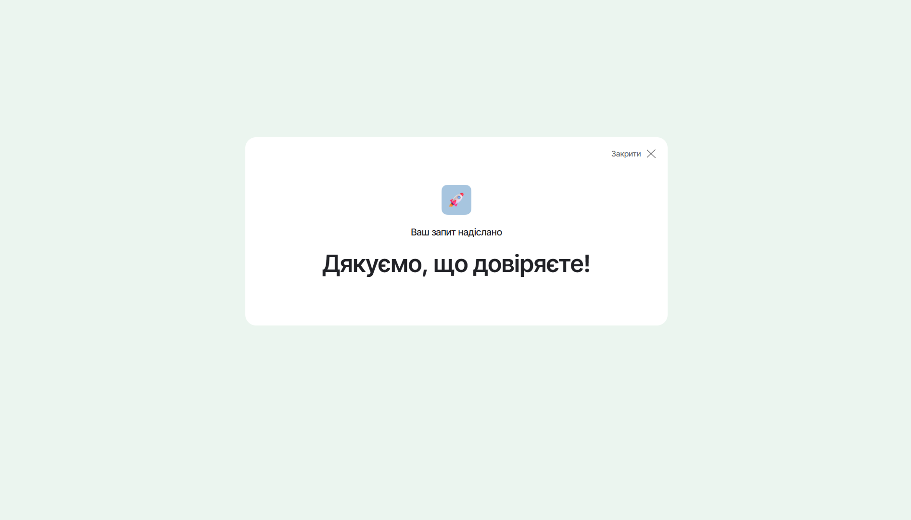

# Contact Form (CTA)

WordPress theme with one section - AJAX-form (CTA) without plugins.

<figure>
  
  <figcaption style="text-align: center">Contact form. The field whose data has not been validated is highlighted with a red color.</figcaption>
</figure>

&nbsp;

<figure>
  
  <figcaption style="text-align: center">Modal window appears after successful submitting form.</figcaption>
</figure>

&nbsp;

<figure>
  
  <figcaption style="text-align: center"> Settings of integrations in admin panel.</figcaption>
</figure>

&nbsp;

<figure>
  
  <figcaption style="text-align: center">Lead in admin panel.</figcaption>
</figure>

## Description of a contact form (CTA Block)

### The form meets the following requirements:

1. No plugins were used to create the form.
2. Name (required, only letters).
3. Email (optional, only email format accepted).
4. Phone number (required, international numbers allowed).
5. Short description (textarea) (optional).
6. An adaptive layout has been developed for screens of different sizes. The layout also meets the requirements of cross-browser compatibility.
7. All possible errors are processed on the backend and returned to the frontend with the corresponding codes - 400 or 500. Information about errors with code 400 appears under the corresponding form field, and information about errors with code 500 is displayed in the console.

### Front functionality:

1. If the form is invalid, the field with the problem is indicated (the frame turns red with an error message under the field).
2. When the form is submitted, a spinner appears on the submit button, and the button itself is disabled.
3. After successful submission, a modal window appears (application accepted), and the form is cleared of entered data.

### Backend functionality:

1. Submitting the form via Ajax.
2. Data is being shielded and checked via regex. The data entered in the fields are processed - spaces at the beginning and end are removed, and between words in the field "name" are collapsed into one.
3. The lead is sent to the email (it is possible to specify the email address via the admin panel. It is assumed that there can be several email addresses).
4. The lead also comes to the admin panel as a separate post type (custom post type).
5. The lead is sent to the telegram bot (it is possible to specify the chat id and bot token via the admin panel)

#### Note:

Hidden data that is transmitted with the lead:

1. Date and time of form submission
2. utm-tags

## Installation and usage:

- Download the theme in zip format.
- In the administrative part of website, go to "Appearance" -> "Themes" -> "Add new theme" -> "Upload theme". Choose the archive and upload it. Activate the theme.
- Create a page, choosing the "Home Page" template.

## Commands:

- npm install - installs npm-dependencies
- npm run build - launches the Gulp task manager
